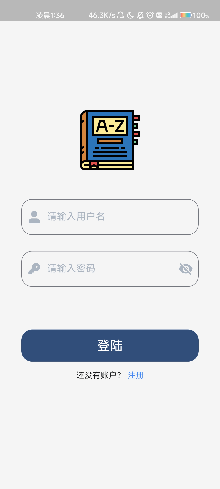
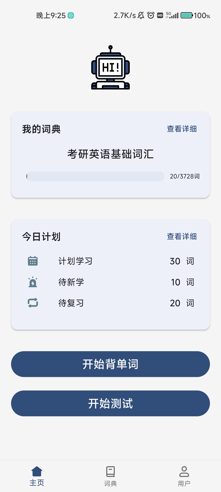
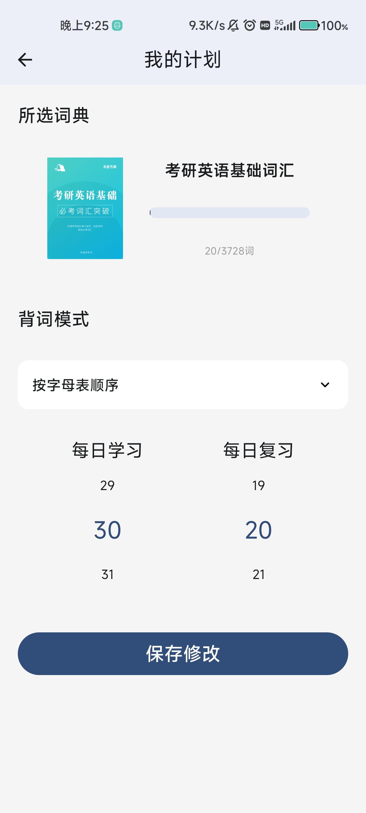
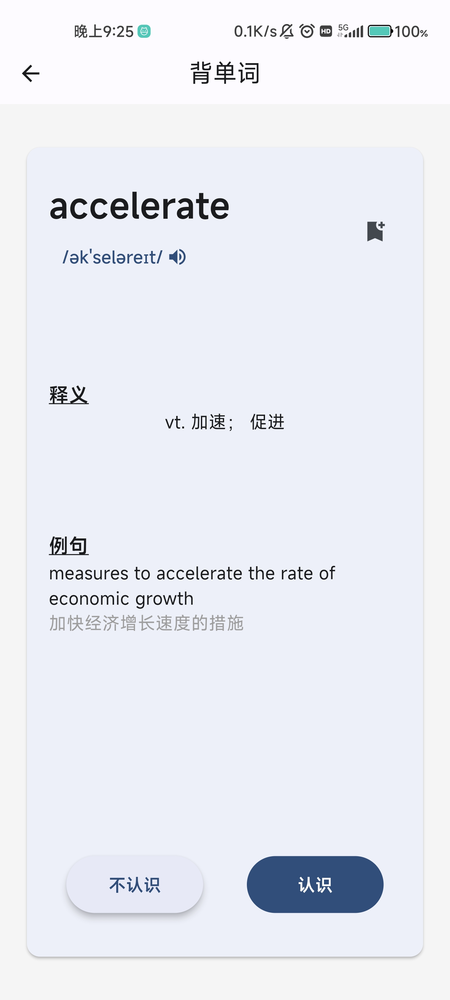
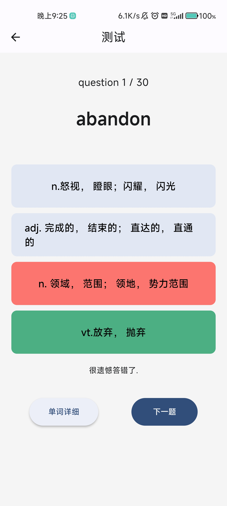

# 来背单词
一个使用flutter构建的背单词app

## 使用须知
本项目为前后端分离的前端部分，配套的后端项目: [word_api](https://github.com/Mrhunderb/word_api)

项目初衷是为了完成学校课程设计，现成绩已公布，遂将本项目开源，供大家使用

## 效果展示

## 构建环境
Flutter 3.16.8 

Tools • Dart 3.2.5 • DevTools 2.28.5
